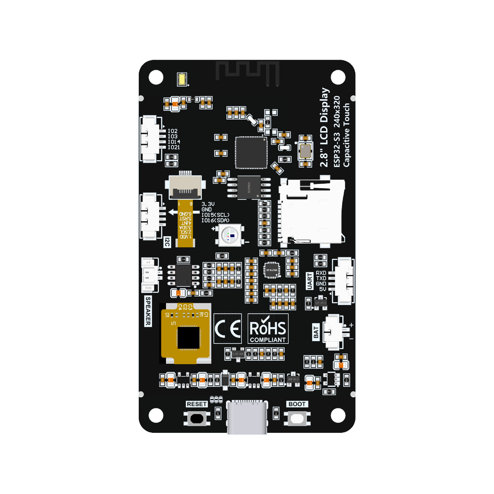

2.8inch ESP32-S3 Display

See [this reference info](https://www.lcdwiki.com/2.8inch_ESP32-S3_Display). Sold under
different brand names - this is the same board as Hosyond's 2.8" ESP32-S3 display, whose
pins are already defined as `ESP32S3HosyondDisplay` in
[arduino-audio-driver](https://github.com/pschatzmann/arduino-audio-driver/blob/main/src/AudioBoards/ESP32S3HosyondDisplay.h)
(that header is the source of truth for the pins below).

## Hardware

-   **MCU:** ESP32-S3
-   **Display:** 2.8", 240x320, ILI9341 (4-wire SPI)
-   **Touch:** FT6336G capacitive, I2C (shares the codec's I2C bus)
-   **Audio:** ES8311 codec + FM8002E speaker amp + on-board MEMS microphone
-   **Storage:** microSD, 4-bit SDIO (not SPI)
-   **Other:** WS2812 RGB LED (`IO42`), battery voltage ADC (`IO9`), 4 spare
    GPIO pins broken out on a header

## Pins

| Function                | Pins                                                  |
| ------------------------ | ------------------------------------------------------ |
| LCD SPI                 | CS=10, DC=46, SCK=12, MOSI=11, MISO=13, RST=shared with EN, BL=45 |
| Touch I2C (FT6336G)     | SDA=16, SCL=15, RST=18, IRQ=17                        |
| Codec I2C (ES8311)      | SDA=16, SCL=15 (same bus as touch)                    |
| Codec I2S               | MCLK=4, BCK=5, WS=7, DOUT=8, DIN=6                    |
| PA enable (FM8002E)     | IO1, active low                                       |
| SD (4-bit SDIO)         | SCK=38, CMD=40, D0=39, D1=41, D2=48, D3=47            |

## Examples

All confirmed working on real hardware (2026-08-18) unless noted otherwise.

-   `audio-out` - sine wave playback through the ES8311/FM8002E speaker
    path, via `AudioBoardStream(ESP32S3HosyondDisplay)`. Confirmed audible.
-   `audio-in` - reads the on-board MEMS mic through the ES8311's ADC path
    and prints PCM samples to Serial as CSV. Confirmed real signal.
-   `sd-test` - brings up the microSD card over 4-bit SDIO (`SD_MMC`),
    writes/reads a test file and lists the root directory. Confirmed.
-   `lcd-test` - [TinyGPU](https://github.com/pschatzmann/TinyGPU)-based
    RGB/greyscale color diagnostic for the ILI9341 panel, with tap-to-switch
    via the FT6336G touch controller. Colors confirmed correct (see the
    display-inversion note below). Touch confirmed working (an initial
    "chip ACKs but reports zero touches" symptom turned out to be the touch
    panel's FPC connector not being fully seated, not a code/driver issue -
    reseating it fixed it).
-   `led-test` - cycles the single WS2812-compatible RGB LED (`IO42`)
    through red/green/blue/white/off. Confirmed working.
-   `player-sdmmc` - MP3 playback straight off the microSD card
    (`AudioSourceSDMMC` + `MP3DecoderHelix`) through the ES8311/FM8002E
    speaker path. Confirmed audible.

### Gotchas found while bringing these up

-   **This board needs `CDCOnBoot=cdc`** (Arduino IDE: Tools > USB CDC On
    Boot > Enabled). It defaults to Disabled, which maps `Serial` to the
    UART0 header pins instead of the native USB port the board is actually
    plugged in through - every `Serial.print`/`printf` call silently goes
    nowhere, while ESP-IDF's own `[INFO]`/`E (...)` log lines still show up
    (they go via the USB-Serial-JTAG peripheral regardless), which is a
    confusing split to debug if you don't know to look for it.
-   **The ILI9341 panel needs display inversion enabled**
    (`tftDriver.writeCommand(0x21);` right after `display.begin()` in
    `lcd-test.ino`) or every color renders as its photographic negative
    (RED shows as cyan, GREEN as magenta, BLUE as yellow) - a common
    ILI9341-clone quirk, not a wiring or driver bug.

## Dependencies

-   [arduino-audio-tools](https://github.com/pschatzmann/arduino-audio-tools)
-   [arduino-audio-driver](https://github.com/pschatzmann/arduino-audio-driver)
    (`audio-out`, `audio-in`, `player-sdmmc`)
-   [TinyGPU](https://github.com/pschatzmann/TinyGPU) (`lcd-test`)
-   [Adafruit_NeoPixel](https://github.com/adafruit/Adafruit_NeoPixel)
    (`led-test`)
-   [arduino-libhelix](https://github.com/pschatzmann/arduino-libhelix)
    (`player-sdmmc`, MP3 decoding)
