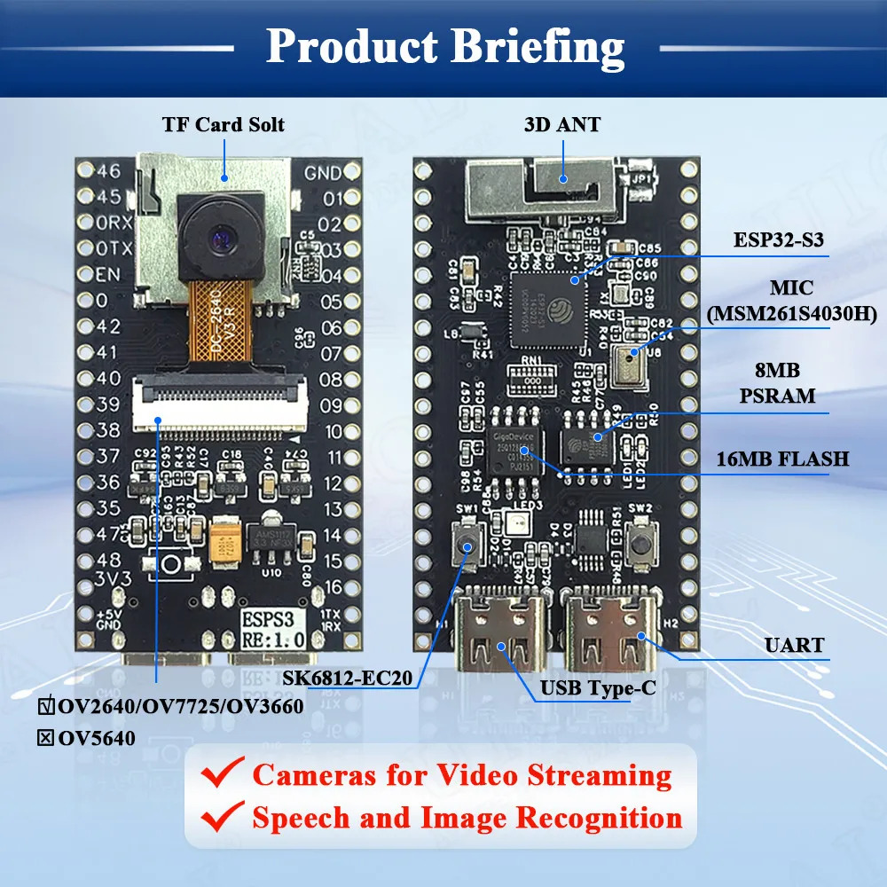

## ESP32S3 Camera Baord

Here are the sketches which test the functionality of this ESP32 S3 camera board

Here is a summary of the limitations/issues that I have found:

- I could not make the 4 pin SDMMC to work.
- The microphone just provides noise
- The board has no Boot button, so you can not set the board easily into upload mode. Here is the work around: 
    - connect GND with Pin 0
    - press and release the SWT2 (Reset/EN button)
    - disconnect Pin 0